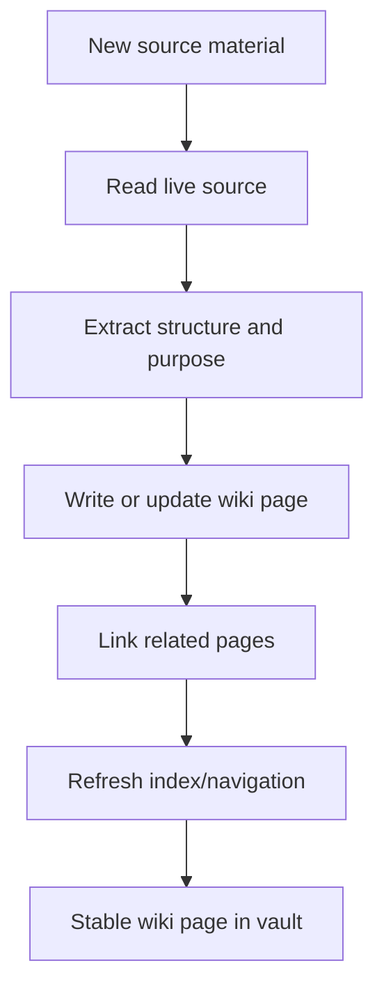
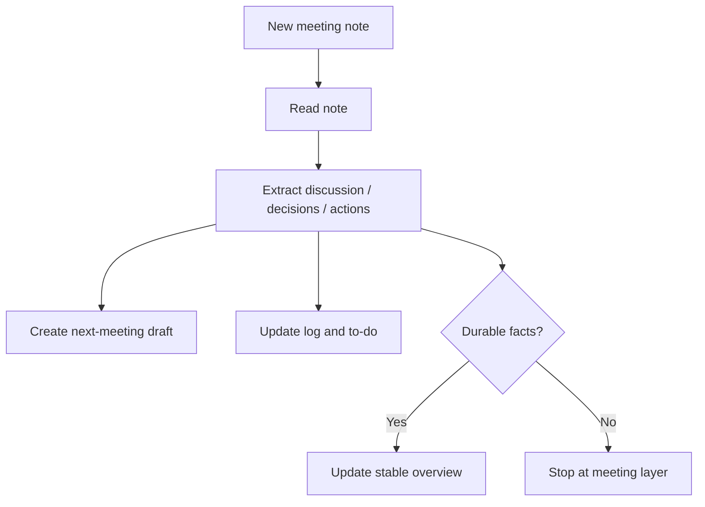
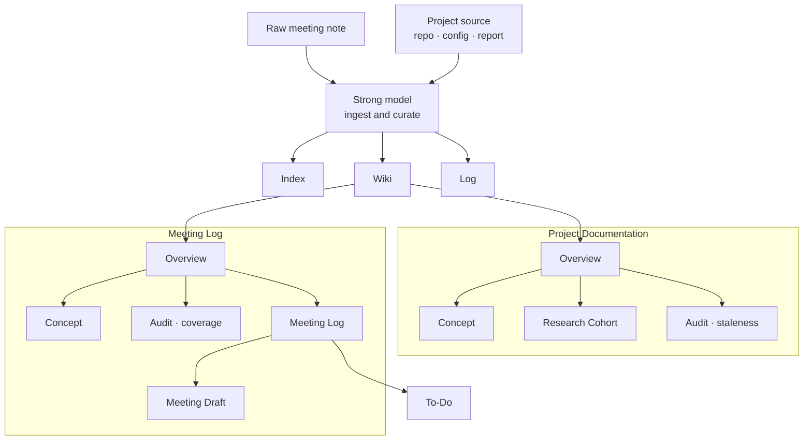
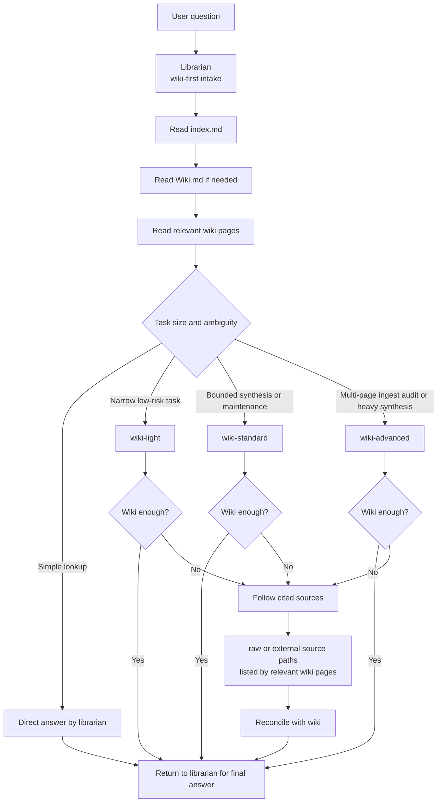
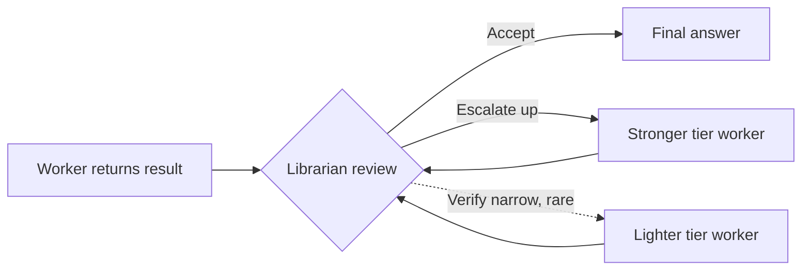

---

title: "From Obsidian Knowledge Graph to Delegated Librarian"

# Post date. Use local date or full timestamp if needed.
date: 2026-05-15

# Public permalink. Folder name can stay organizational/date-prefixed.
url: "/posts/260515-Opencode-Librarian-System"

# Optional short excerpt for list views and SEO/social previews.
# If omitted, posts fall back to .Summary.
description: "I did not start with an agent problem. I started with a memory problem."

# Optional label shown under the title on the post page.
# Common values: a place/event for academic posts, or Personal update.
company: "Personal update"

# Optional. true = load KaTeX assets for $inline$ and $$block$$ math.
math: false
mermaid: true

# Optional bundle-local social preview image for og:image and twitter:image.
# Expected location: content/posts/YYYMMDD-example-name/cover.webp
# If omitted or not found, the site falls back to /general/og_image.webp.
# image: "cover.webp"
---

I did not start with an agent problem. I started with a memory problem.

Over time, I accumulated scripts, research notes, meeting logs, health reports, paper summaries, and small local systems spread across repositories and folders. <!--more--> Everything was technically still available, but availability is not the same thing as retrieval. A fact buried in a repo is not really 
accessible just because it still exists.

So the first thing I built was not an AI workflow. It was a maintained Obsidian vault.

## Step 1: Build the Knowledge Graph First

The vault became the stable layer above the raw files.

Instead of treating every repository, report, or meeting note as something I would rediscover later from scratch, I started converting them into linked notes. That changed the role of the vault. It stopped being a casual note collection and became infrastructure.

The important shift was this:

- raw sources remained the place where things originally came from
- the vault became the place where those things became legible

That gave me something like a personal knowledge graph. Pages linked to other pages. Pipelines linked to outputs. Projects linked to meetings. Reports linked to stable summaries. A question no longer had to start from directory spelunking. It could start from a maintained graph.

This was already useful before any agent touched it.

### How Information Gets Into the Vault

One of the most important practical decisions was that not all information enters the system in the same form.

Some things arrive as relatively stable source material:

- a project repository
- a technical README
- a local tool
- a generated report
- a configuration tree

Other things arrive as event material:

- a meeting note
- a request from someone
- a new decision
- a change in direction
- an action list that will evolve over time

Those two streams need different curation workflows.

If they are treated the same way, the vault becomes confused. Stable infrastructure notes start reading like diaries, while meeting logs start pretending to be timeless documentation.

So the vault works because information is not only stored; it is sorted into the right kind of page.

### The Dumping Layer: Raw First, Then Curated

The system needs a place where information can be dropped in before it becomes polished knowledge.

That is the role of the source layer.

In practice, the flow is usually:

1. something new appears in raw form
2. it is inspected
3. key ideas are extracted
4. those ideas are rewritten into the maintained vault

This matters because "dumping information in" should be easy, while "making it useful later" should be deliberate.

If every new source had to be perfectly organized at the moment it arrived, the system would never keep up with real work. If everything stayed in raw form forever, retrieval would remain painful.

The vault sits between those two extremes.

### Workflow 1: Project Documentation Curation

Project documentation is the easier of the two major workflows because it usually has a stable object underneath it.

One better example is a personal static site built with Hugo.

The live source is not just one script or one README. It has layouts, partial templates, content sections, multilingual strings, data files, JavaScript modules, generated assets, and small helper scripts. The curation work is not to mirror that folder tree into the vault. It is to turn the project into a linked explanation of how the subsystems fit together:

- what the site is for
- how configuration, templates, content, and data divide responsibilities
- which files define reusable page structure
- where live panels or generated assets enter the site
- which accessibility or quality checks matter

That kind of source usually produces more than one wiki page: a compact overview, then focused concept pages for configuration, templates, content types, data files, JavaScript modules, and audits when needed. The value is that future questions can start from the curated map instead of from the repo root.

The source might be:

- a code repository
- a configuration directory
- a script collection
- a report generator
- a README that describes system behavior

The curation job here is to turn implementation shape into reusable understanding.

That usually means:

1. identify the project or tool boundary
2. inspect the live source
3. extract the structure, purpose, and moving parts
4. write one or more stable concept pages
5. connect those pages into the rest of the graph

The end result is not a copy of the repo. It is a maintained explanation of the repo.

This is a very different task from "summarize one file." The point is to make future retrieval possible:

- what is this tool for?
- where does it live?
- what are its dependencies?
- how is it configured?
- what outputs matter?
- what page should I read next?

In that sense, project documentation curation is a translation layer from implementation to memory.

### Workflow 2: Meeting Log Curation

Meeting logs are much more fluid.

One real example is a recurring research-meeting workflow.

When a new meeting note appears in the raw meeting folder, it is not treated like project documentation. The curation task is chronological and action-oriented:

- read the new meeting note
- prepend a dated entry to the meeting log
- refresh the relevant block in the active to-do page
- create or update the next meeting draft in the meetings drafts folder
- only update a stable overview page if the meeting introduced facts that are now durable enough to belong there

That keeps the transient parts of project work in the meeting layer, while letting the stable overview absorb only the decisions that have actually settled.

A meeting note is not a stable object in the same sense as a code repo. It is a time-bound event containing:

- what was discussed
- what changed
- what was decided
- what remains unclear
- what someone now has to do

If project documentation captures structure, meeting logs capture movement.

That makes them interesting because they are often where the real state of a project lives before the stable documentation catches up.

The curation workflow is different:

1. read the raw meeting note
2. extract discussion, decisions, and action items
3. add a dated log entry
4. refresh the active to-do layer
5. create or update the next draft if the workflow uses one
6. only then update any stable overview pages if the meeting introduced durable facts

This is important: not every meeting detail belongs in a stable overview page.

That distinction protects the vault from becoming noisy. Meeting logs preserve chronology. Overview pages preserve settled knowledge.

### Why These Two Workflows Matter Together

The vault becomes powerful because it can hold both kinds of knowledge at once without flattening them into one format.

| Workflow | What it preserves |
|---|---|
| Project documentation | stable structure |
| Meeting logs | evolving state |

That gives the knowledge graph depth.

If you only keep project documentation, you know what a system is supposed to be.

If you only keep meeting logs, you know what people recently said.

If you keep both, you can answer a much better class of questions:

- what does this system do?
- what changed recently?
- what is still unresolved?
- which decisions became stable and which are still provisional?

That is one of the reasons the librarian system became necessary later. The vault was no longer just a static wiki. It had enough structure and enough living state that retrieval itself became a serious task.

Putting both workflows together with the model that drives them, the full picture looks something like this:

Real projects don't share the same shape. A research-leaning project may anchor around cohort pages; an active operational project revolves around the meeting log and a live next-meeting draft. Even audit pages differ in role — some check existing concept pages for staleness, others scan for new information that has appeared but isn't yet documented anywhere. The recurring pattern is the cluster shape, not any specific page-type combination.

### Curation Is the Real Cost

This is the part I think is easy to underestimate.

The expensive thing is not storing information. The expensive thing is converting it into something that will still make sense later.

Project documentation requires abstraction.
Meeting logs require chronology.
Both require judgment.

That is why the vault is valuable. It is not a dump. It is a maintained graph where information has already been forced into a form that a future human or a future agent can use.

## Step 2: One Strong Model For Curation and Retrieval

Once the vault existed, the next obvious idea was simple: point a strong model at it.

At first, the same model did both jobs. In practice, Claude Sonnet 4.6 was excellent at it. It could:

- read across pages
- follow links
- infer which notes mattered
- summarize well
- reconcile slightly messy information without much babysitting

That setup felt magical because it finally matched the structure of the vault. I was no longer asking a model to raw-search my machine every time. I was asking it to walk through a curated graph. The same model that ingested new source material was also the one answering questions about it.

And it worked.

But it also surfaced the next problem very quickly.

## Step 3: Retrieval Is Not the Same as Curation

The same model that was excellent at curation was too expensive to use as the default answerer for every small request.

That difference matters.

There are at least two kinds of work in a system like this:

| **curation work** | **retrieval work** |
| ----------------- | ------------------ |
| - deciding what a page should say | - answering a narrow question |
| - reconciling sources | - finding a value in a note |
| - updating cross-links | - checking whether the vault already knows something |
| - keeping structure coherent | - following one or two links |

The first kind of work deserves a strong model. The second often does not.

If the same expensive librarian answers both, the system works, but the economics are wrong. A question like "what version of this tool is installed" should not cost the same kind of cognitive budget as a multi-page ingest or a source reconciliation pass.

So the problem stopped being "can the librarian do it?" and became "how should the librarian be organized?"

## Step 4: Overhaul the Librarian

The answer was not to remove the librarian. The answer was to demote the librarian from being the sole worker.

The new version became a middle manager. This was the turning point — and the moment I started calling it *the librarian* rather than just "the strong model with vault access."

Instead of one model doing everything, I split the role into two layers:

- a front-desk librarian that understands the vault and decides what kind of job this is
- a set of delegated workers with different costs and strengths

That preserves the intelligence of the system while making the cost structure much more rational.

In other words, the librarian stops being only an answerer and becomes an organizer.

## Step 5: Match Work Complexity to Model Complexity

Once I accepted that the librarian should delegate, the next question became: delegate to whom?

The clean answer was to map work complexity to model complexity.

| Work tier     | Typical tasks                                                                                                                                           | Why it exists                |
| ------------- | ------------------------------------------------------------------------------------------------------------------------------------------------------- | ---------------------------- |
| Light work    | quick page lookup, link checks, frontmatter checks, tiny wording fixes, narrow factual questions                                                        | Cheap and fast               |
| Standard work | refresh one page from a source repo, lint one section of the vault, document a local tool or config tree, sync one bounded update across page/index/log | Judgment, but bounded        |
| Advanced work | multi-page ingest, audits, contradiction checking, meeting or request ingest, workflow redesign, paper-level evidence accounting across multiple notes  | Strongest model belongs here |

What matters here is not just capability. It is discipline. Different tasks deserve different model costs.

### The Actual Constraint: Three APIs, Three Cost Regimes

The model-routing problem was not abstract. It came from a very practical setup:

| Provider lane | Reality |
|---|---|
| OpenAI | paid, most reliable, should be used where accuracy matters most |
| OpenCode free | useful but constrained, best for cheap narrow work or fallback |
| Copilot education | available, but limited enough that it should not become the default heavy worker |

That immediately rules out three naive strategies:

1. always use the strongest paid model
2. always use the cheapest free model
3. always try to maximize "free" before "good"

None of those is actually optimal.

The real objective is to optimize across three dimensions at once:

| Dimension | Question |
|---|---|
| capability | is the model good enough for this task? |
| cost | is this task worth paying premium tokens for? |
| reliability | if this model fails or drifts, what is the next acceptable fallback? |

### The Routing Principle

The final principle was:

- expensive models should sit at the work layer where judgment matters
- cheap models should handle narrow retrieval where mistakes are low-cost
- the front desk should be smart enough to route, but not so strong that it solves everything itself

That is why the librarian itself became a mid-level manager rather than the strongest worker in the system.

### Work-to-Model Mapping Table

This was the practical mapping that emerged from the discussions.

| Work tier | Typical tasks | Primary goal | Best model class |
|---|---|---|---|
| librarian | intake, classify, decide direct vs delegate | good routing at low cost | small but competent paid model |
| light | lookup, link check, frontmatter check, tiny fix | cheapest acceptable accuracy | fast free model |
| standard | single-page refresh, bounded synthesis, section lint | reliable normal work | strong paid model |
| advanced | ingest, audit, cross-page synthesis, ambiguity resolution | strongest judgment | strongest reliable paid model |

### Provider Preference Table

The provider order also needed to be explicit.

| Priority | Provider | Why |
|---|---|---|
| 1 | OpenAI | most reliable paid lane |
| 2 | OpenCode free | best place to save cost on narrow work |
| 3 | Copilot | useful fallback, but too limited to be the main heavy-work lane |

There was one more tie-break rule:

- if OpenAI and Copilot offer roughly comparable models, prefer OpenAI

That stops the system from wasting a limited fallback provider on work that the main paid lane can already handle better.

### Final Tier Table

The concrete routing table became. The appendix at the end of this post lists the exact model IDs currently configured; the tier structure is the durable part.

| Role | Primary | Secondary | Tertiary |
|---|---|---|---|
| librarian | small paid | fast free | fallback |
| wiki-light | fast free | small paid | fast fallback |
| wiki-standard | strong paid | fast free | fallback |
| wiki-advanced | strong paid | strong fallback | free fallback |

This table was not chosen by asking "what is the strongest model?" It was chosen by asking:

- what work really needs the paid lane?
- where is a free model good enough?
- what fallback is acceptable when the preferred lane is unavailable?

### Why the Librarian Should Not Be the Strongest Model

One of the key design discussions was whether the librarian itself should be the best model.

The answer turned out to be no.

If the librarian is too strong:

1. it stops delegating because it can solve the task itself
2. the most expensive model gets consumed by triage work

That defeats the whole economic purpose of delegation.

So the front desk needed to be:

- good enough to classify correctly
- cheap enough not to dominate cost
- weak enough, in a good sense, to keep routing work outward when appropriate

### The Review And Escalation Budget

There was also a separate optimization problem: too many workers can waste tokens just as easily as too few.

So the system adopted an implicit review-and-escalation budget.

| Situation | Ideal delegation pattern |
|---|---|
| simple lookup | librarian only, or librarian -> light |
| single-page maintenance | librarian -> standard |
| advanced synthesis | librarian -> advanced |
| ambiguous widening task | librarian -> light or standard -> librarian review -> possible escalation |

The target was never maximal delegation. It was minimal necessary delegation.

That distinction matters. The system was designed to avoid two opposite failures:

- one overpowered librarian doing everything
- a bureaucratic swarm of agents wasting tokens by passing work around

The point was to find the narrow corridor between them.

### Who Reviews Whom?

This part took some discussion because the most confusing version is a system where workers keep passing work sideways or at the same level.

The cleaner rule is:

- workers do the assigned job
- the librarian reviews the result
- the librarian decides whether to finalize, escalate upward, or ask for a tighter second pass

That means the normal control flow is vertical, not lateral.

| Worker | Normal next step |
|---|---|
| `wiki-light` | return to librarian |
| `wiki-standard` | return to librarian |
| `wiki-advanced` | return to librarian |

Workers are not supposed to endlessly pass work to workers at the same level.

### Do Workers Pass Within the Same Level?

Usually, no.

A `wiki-light` worker does not normally pass to another `wiki-light` worker. That would mostly duplicate cost without improving judgment.

A `wiki-standard` worker also does not normally hand off to a second `wiki-standard` worker just because the task is large. If the task is large enough to require materially different judgment, it should be reviewed by the librarian and then escalated.

The system becomes much easier to reason about if each worker assumes:

- do the bounded job
- stop
- return for review

### Does Light Only Pass to Standard?

Not directly.

The better model is:

1. `wiki-light` returns to the librarian
2. the librarian decides whether the result is enough
3. if not, the librarian escalates to `wiki-standard` or `wiki-advanced`

So the movement is usually:

- `light -> librarian -> standard`
- `light -> librarian -> advanced`
- `standard -> librarian -> advanced`

This keeps the routing logic in one place.

### Can the Flow Ever Move Downward?

Yes, but only as a deliberate review move.

For example:

- `wiki-advanced` may do the heavy synthesis
- then the librarian may ask for a narrower verification pass from `wiki-light` or `wiki-standard`

That is not the same as escalation. It is review.

So upward movement means:

- more complexity
- more judgment
- stronger worker

Downward movement means:

- narrower verification
- cheaper confirmation
- smaller follow-up task

### The Reviewer Model

This is probably the clearest way to think about it:

- the librarian is the reviewer and dispatcher
- the workers are specialists by complexity tier

The workers do not own the final routing logic. The librarian does.

That makes the system much easier to explain than a free-floating swarm of agents.

## Step 6: Build the Delegation System

The final system looks more like an organization chart than a single assistant.

There is now:

- one librarian
- one light worker
- one standard worker
- one advanced worker

The librarian is wiki-first. It starts from the vault, not from the current directory. It reads the maintained graph first, and only follows cited sources when the vault is incomplete, stale, or ambiguous.

Downward verification is the rare branch. The librarian usually handles narrow checks itself. The case where it actually matters is when the result already came from the strongest tier — "escalate up" no longer exists, so dispatching a lighter worker for a bounded second look is the cheapest way to avoid trusting the apex worker blindly.

That means the retrieval flow has become deliberate:

1. start from the maintained note graph
2. answer directly if the question is narrow
3. delegate if the scope widens
4. follow raw or external sources only when necessary

That last point is important. The system does not begin by searching the whole machine. It begins by trusting the curated graph, then escalating outward only when needed.

## Step 7: Let the Librarian Leave the Vault

At first, the wiki logic mostly lived inside the local vault workflow. That was useful, but still too local.

Eventually I wanted something stronger: a librarian I could summon from any working directory on this machine.

So the final move was to configure the librarian globally, outside any one project directory.

Now the behavior I wanted is simple:

- I can be in another directory entirely
- I switch to `librarian`
- I ask a vault question
- the librarian still knows that the Obsidian vault is the primary knowledge base

That changes the nature of the system again.

The librarian is no longer just a note about a workflow. It becomes a persistent interface to the knowledge graph.

## Why This Feels Different

The interesting thing is that none of this started from model selection.

It started from curation.

If there is no maintained knowledge graph, delegation does not help much. You are just sending agents into chaos. Once the vault exists, delegation becomes powerful because the workers have something stable to stand on.

That is why the ordering matters:

1. build the vault
2. curate it seriously
3. assign one good librarian
4. discover that retrieval and curation have different economics
5. overhaul the librarian into a delegated system

I think that sequence is more general than my own setup. A lot of personal AI workflows start too early with orchestration. But orchestration without a maintained knowledge layer is mostly fancy searching.

What made this system useful was not the existence of multiple agents. It was the existence of a curated graph that multiple agents could work against.

## The Real Lesson

The real lesson is not "use more agents."

It is:

- build a stable knowledge layer first
- separate curation from retrieval
- then use delegation to control cost without losing judgment

The first librarian proved the vault could work.

The delegated librarian made it sustainable.

## Appendix: 

My setup is fairly simple but structured: I use OpenCode as the local agent orchestrator, Obsidian as the knowledge base, and a small set of model routes behind OpenCode for different task tiers. The raw source stays in the filesystem, the useful parts get curated into linked notes in the vault, and the agent layer works against that curated graph instead of searching everything from scratch.

This is the concrete routing table encoded in the OpenCode agent config as of the time of writing. The tier labels used throughout the post are the durable part; specific model IDs will change as providers update their offerings.

`librarian`

| Tier | Model |
| - | - |
| Primary | openai/gpt-5.4-mini |
| Secondary | opencode/minimax-m2.5-free |
| Tertiary | github-copilot/claude-sonnet-4.5 |

`wiki-light`

| Tier | Model |
| - | - |
| Primary | opencode/deepseek-v4-flash-free |
| Secondary | openai/gpt-5.4-mini |
| Tertiary | github-copilot/claude-haiku-4.5 |

`wiki-standard`

| Tier | Model |
| - | - |
| Primary | openai/gpt-5.4 |
| Secondary | opencode/minimax-m2.5-free |
| Tertiary | github-copilot/claude-sonnet-4.5 |

`wiki-advanced`

| Tier | Model |
| - | - |
| Primary | openai/gpt-5.4 |
| Secondary | github-copilot/claude-sonnet-4.6 |
| Tertiary | opencode/nemotron-3-super-free |

`wiki-advanced` ranks Copilot before OpenCode-free in its fallback chain. The general provider preference (OpenAI > OpenCode free > Copilot) does not apply at the apex tier because the strongest available Copilot model is closer in capability to the OpenAI strong tier than the strongest available free model.
